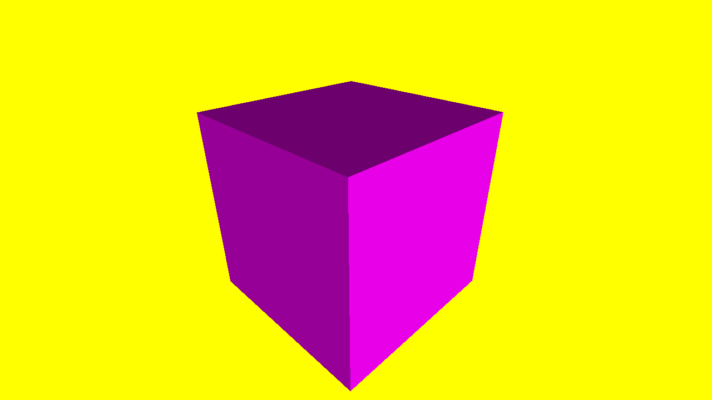

# Lighting

This sample shows on how you can add meshes to the ray tracer and shade them using a directional light. 

<figure>
    
    <figcaption><i>The result of the simple shading of this sample.</i></figcaption>
</figure>

### Controls
To see the full cube, you can move the camera around with the following controls:
- `W` : Go forwards.
- `A` : Go left.
- `S` : Go backwards.
- `D` : Go right.

- `Q` : Go up.
- `E` : Go down.

- `Up arrow` : Rotate up.
- `Left arrow` : Rotate left.
- `Down arrow` : Rotate down.
- `Right arrow` : Rotate right.

- `Esc` : Quit sample.

### What can be learned from this sample?
- Simple shading in the ray tracer.
- Getting vertex data in the closest hit shader.

### Notes
- This ray tracer uses a right-handed coordinate system, where the z coordinate is up.
- PIX events are missing.